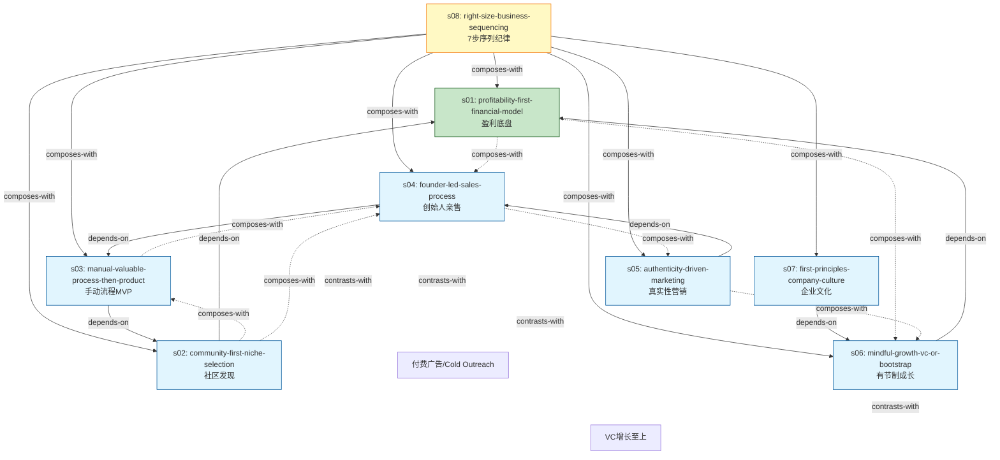

# The Minimalist Entrepreneur — Skill Index

> 本书由 cangjie-skill 蒸馏, 共产出 **8** 个 skills。
> 处理时间: 2026/07/17

## 关于这本书

- **作者**: Sahil Lavingia (Pinterest 第2号员工, Gumroad 创始人)
- **出版年**: 2021
- **一句话主旨**: 以盈利为第一目标、从社区出发、最小化构建产品、用真实故事做营销、在不牺牲生活方式的前提下建立可持续的小而美企业。
- **整书理解**: 见 [BOOK_OVERVIEW.md](./BOOK_OVERVIEW.md)
- **精华长文** (不读全书看这篇): [DIGEST.md](./DIGEST.md)
- **术语词典**: [GLOSSARY.md](./GLOSSARY.md)

---

## Skill 列表 (按业务序列主题分组)

本书的核心交付物是一条 7-步序列 (`right-size-business-sequencing`), 加上 1 个盈利底盘, 共 8 个 skill。其中 `right-size-business-sequencing` 是元技能, 其他 7 个对应序列中具体步骤的执行细节。

### 1. 元技能 (Meta-skill)

- [`right-size-business-sequencing`](./right-size-business-sequencing/SKILL.md) — 7 步序列纪律: Community → Process → Product → Sales → Marketing → Growth → Culture, 严禁跳步。

### 2. 序列 Step 0 — 盈利底盘 (Profitability First)

- [`profitability-first-financial-model`](./profitability-first-financial-model/SKILL.md) — 盈利优先的财务模型: profit is oxygen, 贩卖人群 vs 卖给用户, 客户即投资人的反向价值链。

### 3. 序列 Step 1-7 — 逐步执行

#### Step 1 — 从社区开始
- [`community-first-niche-selection`](./community-first-niche-selection/SKILL.md) — 用"黄金社区筛选 + 真正社区 vs 网络"双框架选出值得投入 3-5 年的"金发姑娘"社区。

#### Step 2 — 最小化构建
- [`manual-valuable-process-then-product`](./manual-valuable-process-then-product/SKILL.md) — 用手动/手工流程先交付价值, 验证后再 productize。MVP 真正含义是 Manual Valuable Process。

#### Step 3 — 卖给前 100 客户
- [`founder-led-sales-process`](./founder-led-sales-process/SKILL.md) — 创始人亲售的三圈漏斗: 亲友 → 社区 → 陌生人;必须收费;销售即研究。

#### Step 4 — 真实性营销
- [`authenticity-driven-marketing`](./authenticity-driven-marketing/SKILL.md) — 用"做自己"换流量:1% 法则 + Educate/Inspire/Entertain 三级内容 + 邮件列表作为自有地。

#### Step 5 — 有节制成长
- [`mindful-growth-vc-or-bootstrap`](./mindful-growth-vc-or-bootstrap/SKILL.md) — 何时/该不该融资扩张:三资本模型、降本清单、慢雇用、众筹作为中间道路。

#### Step 6 — 第一性原理企业文化
- [`first-principles-company-culture`](./first-principles-company-culture/SKILL.md) — 从价值观到招聘:价值观过滤器、JD 当筛子、双向契合、不合就尽早坦诚了断。

---

## 引用图



图例:
- `-->`  depends-on
- `-.->` composes-with
- `~~~>` contrasts-with
- 🟡 黄=元技能 · 🟢 绿=底盘 · 🔵 蓝=序列步骤

---

## 推荐学习顺序 (从依赖图的根节点开始, 向下)

按作者原著章节顺序, 这是最低摩擦的消化路径:

1. **`right-size-business-sequencing`** — 先看完整序列地图,知道现在在哪
2. **`profitability-first-financial-model`** — 理解盈利底盘 (S1)
3. **`community-first-niche-selection`** — 选社区 (S2)
4. **`manual-valuable-process-then-product`** — 手动验证 (S3)
5. **`founder-led-sales-process`** — 亲售 100 客户 (S4)
6. **`authenticity-driven-marketing`** — 内容放大 (S5)
7. **`mindful-growth-vc-or-bootstrap`** — 扩张决策 (S6)
8. **`first-principles-company-culture`** — 文化与招聘 (S7)

---

## 何时该用什么 skill (决策表)

| 用户场景 | 调用哪个 skill |
|---|---|
| 还没 idea,想创业 | `community-first-niche-selection` |
| 不知道从哪起步,纠结"先做什么后做什么" | `right-size-business-sequencing` |
| 想做产品但还没验证需求 | `manual-valuable-process-then-product` |
| 已经有东西,不知道前 100 客户从哪来 | `founder-led-sales-process` |
| 粉丝多但没转化,准备投广告 | `authenticity-driven-marketing` |
| 纠结要不要融资/扩张 | `profitability-first-financial-model` 或 `mindful-growth-vc-or-bootstrap` |
| 招第一个员工,定价值观 | `first-principles-company-culture` |
| 任何"我该做什么"的元问题 | `right-size-business-sequencing` |

---

## 安装使用

本目录是构建产物, 宿主不会从这里加载 skill。要让 agent 真正调用, 把 skill 目录复制到宿主的 skills 目录:

```bash
# 用户级 (所有项目可用)
cp -r right-size-business-sequencing ~/.claude/skills/
cp -r profitability-first-financial-model ~/.claude/skills/
cp -r community-first-niche-selection ~/.claude/skills/
cp -r manual-valuable-process-then-product ~/.claude/skills/
cp -r founder-led-sales-process ~/.claude/skills/
cp -r authenticity-driven-marketing ~/.claude/skills/
cp -r mindful-growth-vc-or-bootstrap ~/.claude/skills/
cp -r first-principles-company-culture ~/.claude/skills/

# 或项目级
cp -r <skill-slug> <project>/.claude/skills/    # Claude Code
cp -r <skill-slug> <project>/.cursor/skills/    # Cursor
```

---

## 接入 darwin-skill

所有 skill 均带有 `test-prompts.json` (darwin-skill 兼容格式), 可直接接入自动进化:

```
darwin evolve books/the-minimalist-entrepreneur/
```

---

## 审计轨迹

- **候选单元池**: 157 (框架 25 + 原则 65 + 案例 22 + 反例 25 + 术语 20)
- **通过三重验证**: 88 (框架 9 + 原则 14 + 案例 22 + 反例 25 + 术语 18)
- **通过率**: 56% (符合方法论书预期 30-50% 框架/原则门 + 80-100% 反例门)
- **审计目录**: [candidates/](./candidates/) · [rejected/](./rejected/)
- **整书理解**: [BOOK_OVERVIEW.md](./BOOK_OVERVIEW.md)
- **验证记录**: [verified.md](./verified.md)
